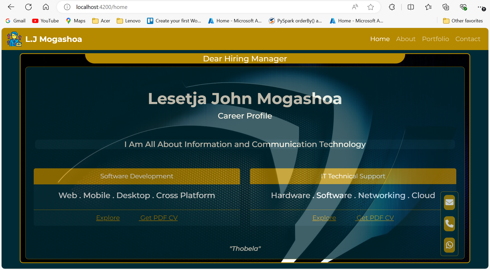

# MyPortfolio

# Deployed Site on Vercel
[Visit Site](https://my-portfolio-three-nu-17.vercel.app/home/)

# Technologies Used
Angular ~ Typescript ~ Bootstrap ~ HTML ~ CSS
  
This project was generated with [Angular CLI](https://github.com/angular/angular-cli) version 18.2.1.
# How to run this Project Locally
1. Clone this Repository to a local folder on your computer
2. Open terminal on your coding environment
3. On the terminal, navigate to the project's directory. e.g cd my-porfolio
4. Run `npm start` or `ng serve` for a dev server. Continue with further instructions below

## Development server

Run `ng serve` for a dev server. Navigate to `http://localhost:4200/`. The application will automatically reload if you change any of the source files.

## Build

Run `ng build` to build the project. The build artifacts will be stored in the `dist/` directory.

## Running unit tests

Run `ng test` to execute the unit tests via [Karma](https://karma-runner.github.io).

## Running end-to-end tests

Run `ng e2e` to execute the end-to-end tests via a platform of your choice. To use this command, you need to first add a package that implements end-to-end testing capabilities.

## Further help

To get more help on the Angular CLI use `ng help` or go check out the [Angular CLI Overview and Command Reference](https://angular.dev/tools/cli) page.
